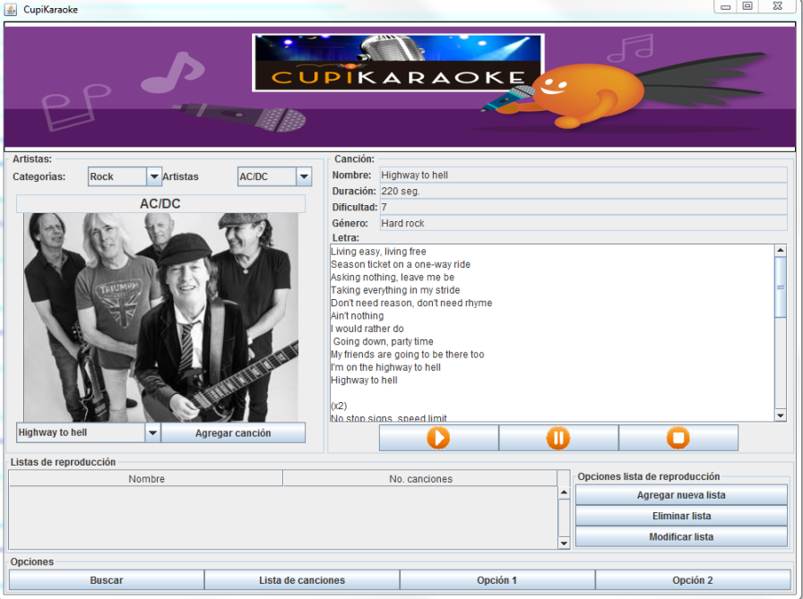

# Enunciado

Se desea desarrollar una aplicación para administrar las canciones de un karaoke. La aplicación tiene 4
categorías musicales (Rock, Pop, Fusión latina y Electro) y 9 artistas que pertenecen a una de las
diferentes categorías. Adicionalmente, la aplicación debe permitir el manejo de listas de reproducción, donde
cada lista puede tener canciones de diferentes artistas.

Un artista puede referirse a una banda o un artista solitario.

De cada artista se conoce:

- El nombre. No pueden existir dos artistas con el mismo nombre.
- Una imagen del artista.
- La lista de sus canciones, no pueden existir dos canciones con el mismo nombre.

Para cada canción, se tiene la siguiente información:

- Nombre.
- Duración en segundos.
- Dificultad: valor entre 1 y 10 que indica la dificultad para interpretar la canción, donde 1 es la dificultad
más baja y 10 la más elevada.
- Letra de la canción.
- Archivo con la pista de la canción en formato mp3.

Para cada lista de reproducción se tiene:

- Nombre. No pueden existir dos listas de reproducción con el mismo nombre.
- Número de canciones.
- La lista de sus canciones, donde no se puede agregar dos veces la misma canción y debe tener al
menos una canción.

Se requiere que la aplicación permita:

1. Mostrar la información de un artista.
2. Agregar una canción a un artista del karaoke.
3. Mostrar la información de una canción.
4. Reproducir una canción.
5. Pausar la reproducción de una canción.
6. Detener la reproducción de una canción.
7. Buscar la canción más fácil.
8. Buscar la canción más difícil.
9. Buscar la canción más larga.
10. Buscar la canción más corta.
11. Buscar el artista con mayor número de canciones.
12. Mostrar todas las canciones de una categoría.
13. Ver la lista de todas las listas de reproducción existentes en el karaoke.
14. Crear una lista de reproducción.
15. Eliminar una lista de reproducción.
16. Agregar una canción a una lista de reproducción.
17. Eliminar una canción de una lista de reproducción.

# Interfaz

